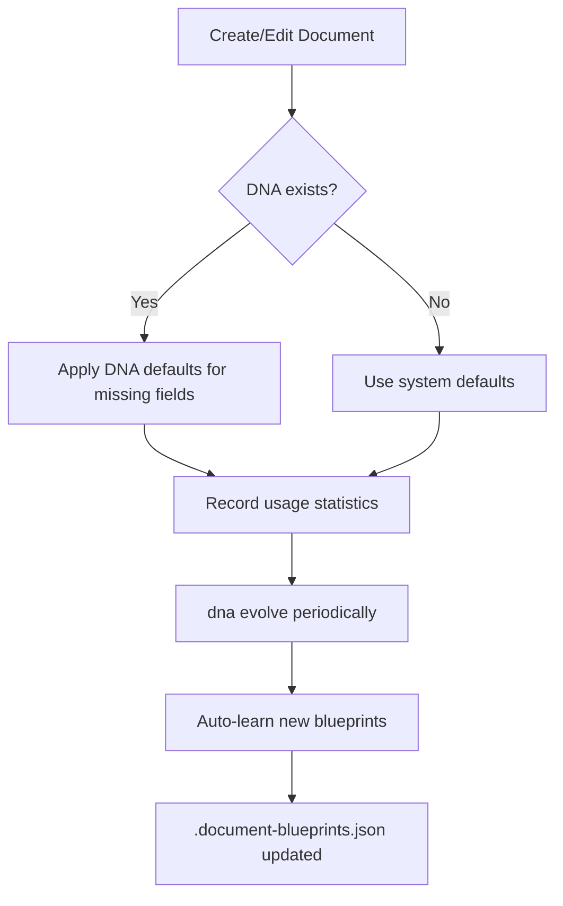

# MCP Document Processor

An MCP (Model Context Protocol) server for reading, creating, and managing PDF, DOCX, and Excel documents with professional styling, automatic categorization, and intelligent document management. Built by LeanZero as part of the [LeanZero](https://leanzero.atlascrafted.com) ecosystem.

---

## 🚀 Quick Start

### Installation
```bash
npm install
```

### MCP Configuration

Add to your MCP client configuration (e.g., `mcp.json`, `cline_mcp_settings.json`):

```json
{
  "mcpServers": {
    "doc-processor": {
      "command": "node",
      "args": ["/absolute/path/to/mcp-doc-processor/src/index.js"],
      "env": {}
    }
  }
}
```

### Verify Installation
```bash
npm start
# Server should output: MCP Document Processor server running on stdio
# Vision Provider: lm-studio (or your configured provider)
```

---

## 🛠️ Tools Reference

| Tool | Description | Key Parameters |
|------|-------------|----------------|
| `read-doc` | Read and analyze PDF, DOCX, or Excel files with three modes | filePath, mode, userQuery, context |
| `detect-format` | Recommend format/tone for new documents | userQuery, title, content |
| `create-doc` | Create a styled Word DOCX document | filePath (for edit), action, title, paragraphs, tables, stylePreset, category, tags, docType |
| `create-markdown` | Create implementation-focused markdown files | title, paragraphs, outputPath, category, tags, description, dryRun, docType |
| `create-excel` | Create a styled Excel XLSX workbook | sheets (array of {name, data}), stylePreset, custom styling overrides, outputPath, enforceDocsFolder, preventDuplicates, dryRun, category, tags, description, docType |
| `edit-doc` | Edit existing DOCX files with append/replace actions | filePath, action, title, paragraphs, tables, stylePreset, category, tags, docType |
| `edit-excel` | Edit existing Excel workbooks | filePath, action, sheetName, rows, sheetData, stylePreset, category, tags, docType |
| `list-documents` | Search and filter the document registry | category, tags, title |
| `dna` | Manage Document DNA (styling defaults & memories) | action, companyName, stylePreset, headerText, footerText, apply, threshold, memory, key |
| `blueprint` | Manage structural templates from existing documents | action, filePath, name, description |
| `drift-monitor` | Track document changes over time with fingerprinting | action, filePath, name |
| `get-lineage` | Trace provenance of any created document | filePath, depth |
| `list-templates` | Browse available blueprints and templates | category (optional) |

---

## 🧬 Document DNA System

Document DNA (`.document-dna.json`) automatically applies consistent styling across all documents created by this server.

### How It Works



### DNA Actions

| Action | Description | Example |
|--------|-------------|---------|
| `init` | Create initial DNA with defaults | `dna action:init companyName:"My Company"` |
| `get` | Return current config and memories | `dna action:get` |
| `evolve` | Analyze usage patterns & suggest improvements | `dna action:evolve apply:true` |
| `save-memory` | Store a document preference | `dna action:save-memory memory:"Always use 1.5 line spacing"` |
| `delete-memory` | Remove a saved preference | `dna action:delete-memory key:"spacing_pref"` |

### DNA Inheritance Hierarchy

```text
System Defaults (hardcoded)  <-- lowest priority
Project DNA (.document-dna.json)
User DNA (.document-user.json) <-- highest priority, overrides all above
```

---

## 🏗️ Blueprint System

Blueprints are structural templates extracted from existing documents that ensure consistent document structure.

### Creating a Blueprint

**From an existing document:**
```bash
blueprint action:learn filePath:"docs/contracts/service-agreement.docx" name:"contract_template" description:"Standard service agreement template with signature section"
```

**Auto-learned during DNA evolution:**
When `dna evolve` detects recurring patterns, it automatically creates blueprints and notifies you in the response.

### Using a Blueprint When Creating Documents

```json
{
  "tool": "create-doc",
  "arguments": {
    "title": "New Client Agreement",
    "blueprintName": "contract_template",
    "category": "contracts",
    "stylePreset": "legal"
  }
}
```

---

## 🔍 Drift Detection System

Monitor documents for structural changes over time with fingerprint-based comparison.

### How It Works

1. **Baseline creation**: `drift-monitor action:watch` generates a document fingerprint (structural hash) and stores it in `.document-drift.json`.
2. **Monitoring**: Periodically run `drift-monitor action:check` to compare current state against baseline.
3. **Drift report**: Detects heading changes, word count shifts, content similarity drops, and category drifts.

### Practical Example

```bash
# Watch a critical contract for structural drift
drift-monitor action:watch filePath:"docs/contracts/master_agreement.docx" name:"critical_contract"

# Check for drift weekly
drift-monitor action:check filePath:"docs/contracts/master_agreement.docx"
```

---

## 🔗 Lineage Tracking System

Automatically track which source documents informed each created document, building a provenance chain.

### How to Query Lineage

```json
{
  "tool": "get-lineage",
  "arguments": {
    "filePath": "docs/contracts/client_agreement_v2.docx",
    "depth": 3
  }
}
```

**Returns:** A chain showing: `source documents` → `intermediate derivations` → `final document`.

---

## 🎨 Style Presets Reference

| Preset | Font | Best For | Key Traits |
|--------|------|----------|------------|
| `minimal` | Arial, 11pt | Clean Swiss style | Light zebra striping, subtle borders |
| `professional` | Garamond, 11pt | Executive reports | Serif, justified, double-spaced headings |
| `technical` | Segoe UI, 11pt | Developer docs | High contrast tables, strong hierarchy |
| `legal` | Times New Roman, 12pt | Contracts & legal docs | Double-spaced, underlined headings |
| `business` | Calibri, 11pt | Corporate communications | Blue accent palette, centered title with border |
| `casual` | Verdana, 12pt | Newsletters & informal comms | Warm orange accents, friendly style |
| `colorful` | Segoe UI, 11pt | Presentations & creative docs | Purple-teal gradient, vibrant headers |

---

## 📂 Generated Files Reference

| File | Purpose | Managed By |
|------|---------|------------|
| `.document-dna.json` | Document DNA configuration | `dna` tool (auto) |
| `.document-blueprints.json` | Blueprint repository | `blueprint` + auto-learning |
| `docs/registry.json` | Document registry with metadata | All creation tools |
| `.document-user.json` | User-level DNA overrides | Optional, user-created |
| `logs/*.log` | Server logs for debugging | Automatic |

---

## 🧪 Testing Suite

```bash
npm test                    # Full integration suite (52+ tests)
npm run test:ocr            # OCR improvements verification
npm run test:styling        # Style presets and document creation
npm run test:create         # create-doc + create-excel integration
npm run test:patch          # DOCX XML patching
npm run test:category       # Categorization and registry
npm run test:dna            # DNA system functionality
npm run test:innovations    # Innovation features (52 tests)
npm run test:drift          # Drift detection internals
npm run test:auto-blueprint # Auto-blueprint learning
```

---

## ⚙️ Environment Variables

| Variable | Default | Description |
|-----------|---------|-------------|
| `VISION_PROVIDER` | `lm-studio` | OCR provider: `lm-studio` or `zai` |
| `LM_STUDIO_BASE_URL` | `http://localhost:1234/api/v0` | LM Studio API endpoint for local OCR |
| `Z_AI_API_KEY` | -- | Z.AI cloud vision service key |
| `SKIP_TABLE_EXTRACTION` | `true` | Skip table extraction from images during PDF processing |

---

## 📄 License

See [LICENSE](LICENSE) for details.

---

**Built by LeanZero.** For feedback, report issues via `/reportbug`.